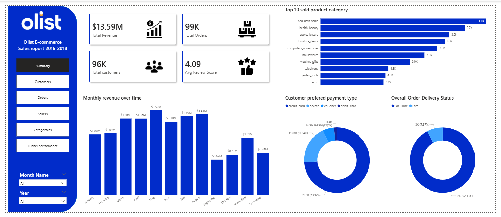

# Power BI Dashboards

## Tools Used
- Power BI Desktop
- DAX
- SQL-derived analytical tables

## Dashboards Included

### 1. E-Commerce Performance Dashboard
- 5-page interactive dashboard
- Customer, order, seller, product insights
- Built on star schema analytical model

### 2. Marketing Funnel Performance Dashboard
- End-to-end seller acquisition funnel
- MQL -> Closed deal conversion
- Lead origin effectiveness
- Revenue quality of acquired sellers
 
## Screenshots

### E-Commerce Dashboard (Preview)

- [View ecommerce dashboard screenshots](screenshots/ecommerce/)

### Marketing Funnel Dashboard
- [View marketing funnel dashboard screenshot](screenshots/marketing/)
